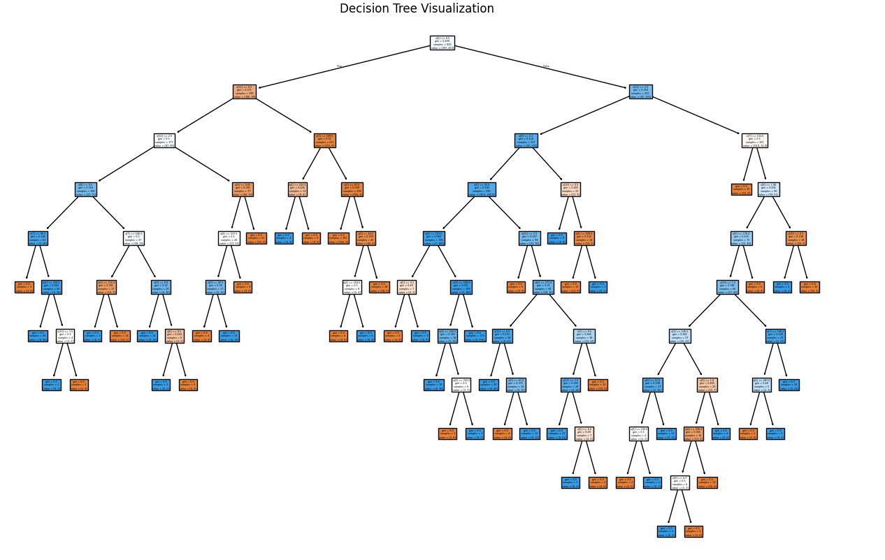
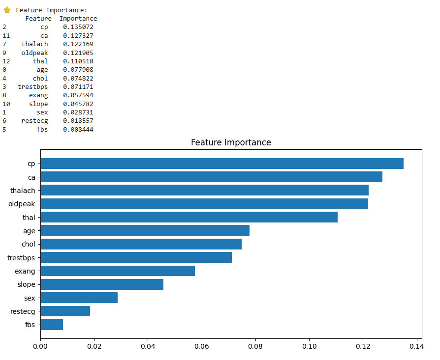

# 🌳 Task 5: Decision Trees and Random Forests

## 📌 Objective
To understand and implement tree-based machine learning models for classification, including Decision Trees and Random Forests, and compare their performance.

---

## ⚙️ Tools & Technologies
- Python
- Scikit-learn
- Pandas
- Matplotlib
- Google Colab

---

## 📂 Dataset Preview

---

## 🚀 Implementation Steps

1. Loaded and explored dataset  
2. Split data into training and testing sets  
3. Trained Decision Tree model  
4. Visualized Decision Tree  
5. Controlled overfitting using max_depth  
6. Trained Random Forest model  
7. Compared model accuracies  
8. Analyzed feature importance  
9. Evaluated using cross-validation  

---

## 🌳 Decision Tree Visualization

---

## 📊 Model Accuracy

### 🔹 Decision Tree Accuracy

### 🔹 Random Forest & Pruned Tree Accuracy

---

## ⭐ Feature Importance

---

## 🔁 Cross Validation Results

---

## 📈 Final Results

---

## ✅ Conclusion

- Decision Tree performs well but is prone to overfitting  
- Pruned Tree reduces overfitting and improves generalization  
- Random Forest gives the best performance due to ensemble learning  
- Cross-validation confirms model stability  

---

## 💡 Key Learnings

- Tree-based models are easy to interpret  
- Overfitting can be controlled using pruning  
- Ensemble methods like Random Forest improve accuracy  
- Feature importance helps understand model decisions  

---

## 📌 Author
PRIYANSH BHATT
